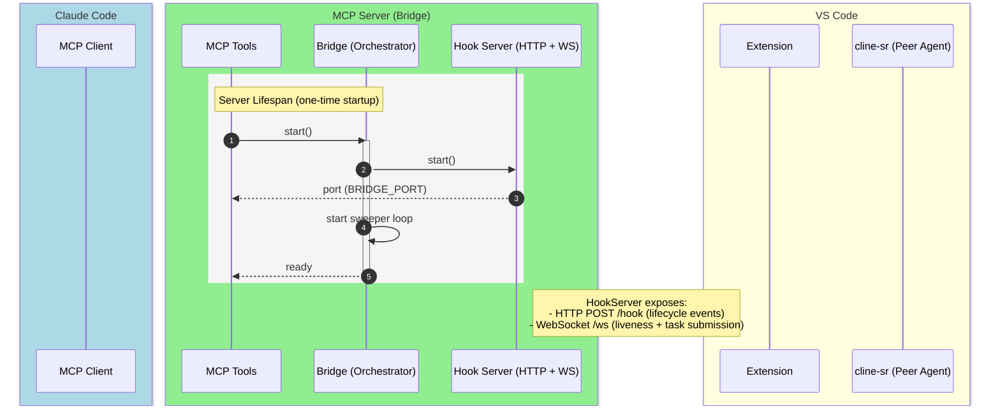
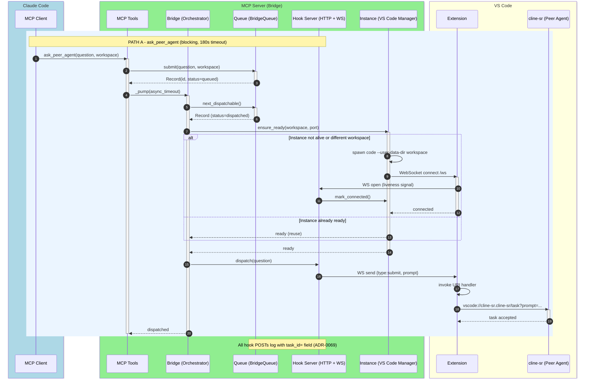
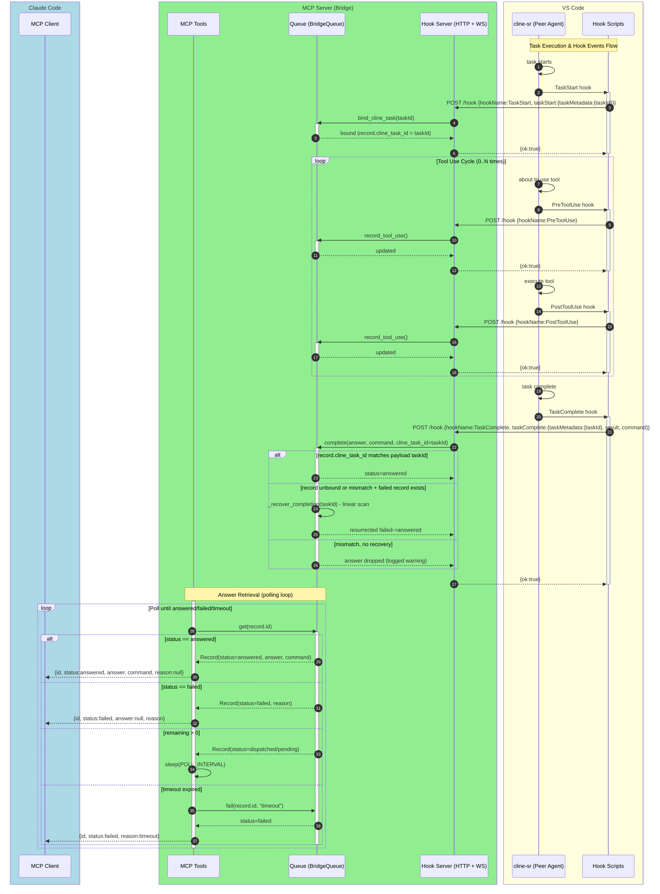
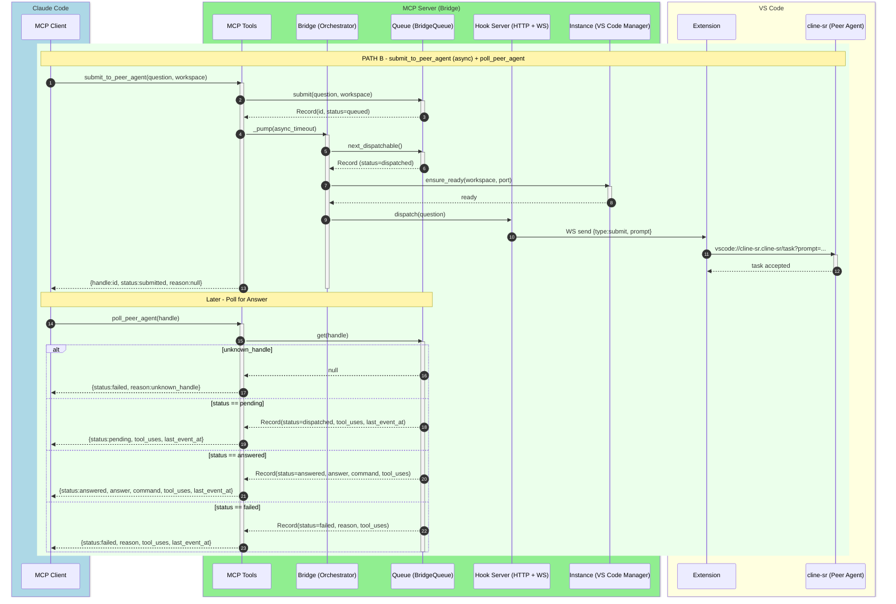
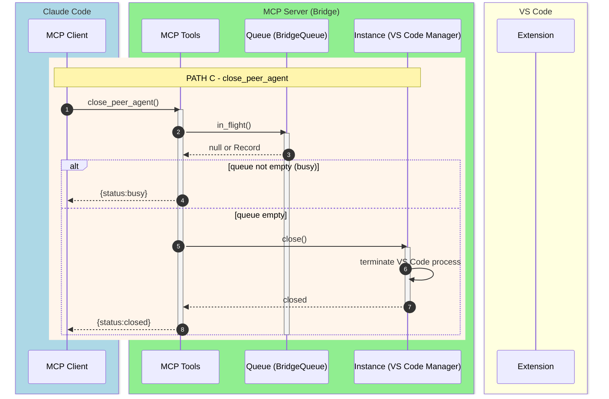
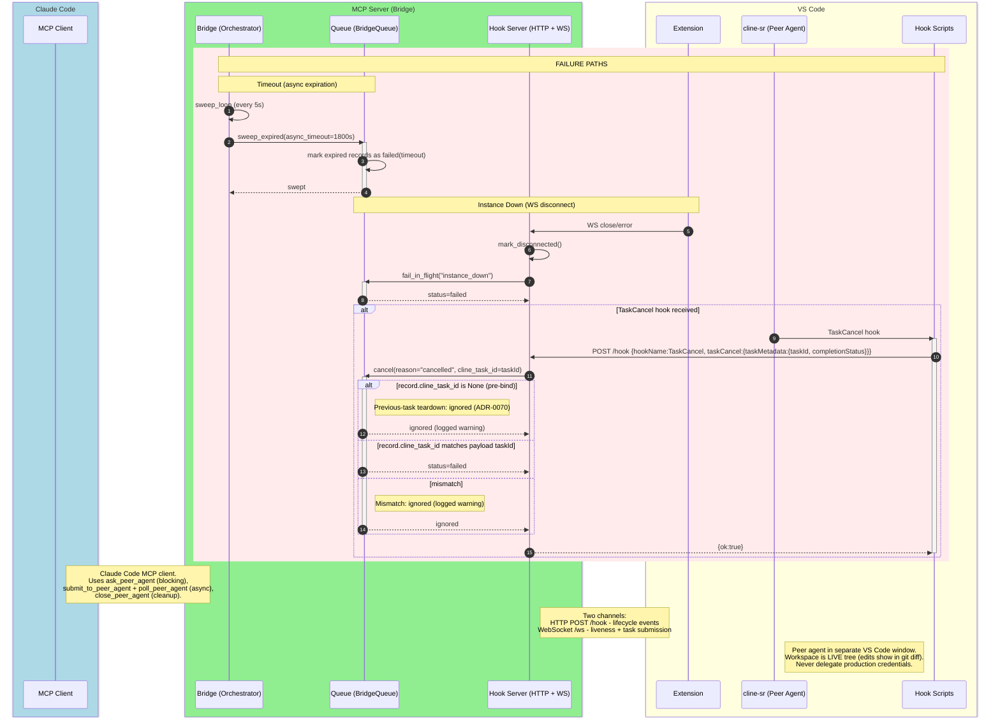

# ADR-0068: Introduce Bridge orchestration module in vscode-agent-bridge

**Date:** 2026-08-29

**Status:** Implemented

## Context

The vscode-agent-bridge MCP server coordinates three tightly coupled objects — `BridgeQueue`, `InstanceManager`, and `HookServer` — across four MCP tool functions (`ask_peer_agent`, `submit_to_peer_agent`, `poll_peer_agent`, `close_peer_agent`) and a background pump/sweep loop. Today all three are module-level singletons in `server.py`, and test fixtures rebuild them by hand via `monkeypatch.setattr(srv, "queue", ...)`.

This creates two seams where there should be one:
1. **Tool functions reach directly past their interface into module internals** — they depend on private globals, not on the MCP framework's actual seam (the tool contract).
2. **Tests can only reset state by mutating module attributes** — the same seam the production code uses — making it unclear whether tests exercise the public interface or just the fixture's wiring.

## Decision

Introduce one **Bridge** module (a class wrapping queue + instance + hooks + pump/sweep logic) with a small interface: `ask()`, `submit()`, `poll()`, `close()`. This module will be constructed once per server process in the `lifespan()` context manager and threaded to tool functions via the MCP framework's `Context` injection mechanism (`ctx.request_context.lifespan_context`), following the precedent in `mcp-vectors/server.py`.

After this change:
- `server.py` contains only tool functions and thin `lifespan()` wiring; no mutable module state.
- Tests construct a `Bridge()` directly and call its methods, exercising the actual interface.
- The pump/sweep loop becomes internal to `Bridge`, owned by the same module that owns the queue.

## Consequences

**Positive:**
- Locality: queue/instance/hooks wiring lives in one place, not re-derived per test file.
- Leverage: one interface backs 4 tools + pump + sweep.
- Testability: fixture construction becomes `Bridge()` instead of three `monkeypatch.setattr()` calls.
- Deletion test passes: removing `Bridge` redistributes its orchestration logic across all callers (ask/submit/poll/close + pump + sweep), proving it concentrates complexity.

**Negative:**
- Adds one class and moves ~100 lines of code.
- Requires learning MCPServer's `Context` injection pattern (but precedent exists in the repo).

## Appendix: End-to-End Sequence Diagrams

The integration flow between Claude Code and the cline-sr peer agent is split into separate diagrams by use case. Participants are grouped by process boundary:
- **Claude Code** — MCP client that invokes tools
- **MCP Server (Bridge)** — Bridge process containing MCP tools, Bridge orchestrator, Queue, HookServer, and Instance manager
- **VS Code** — Extension, cline-sr peer agent, and hook scripts

---

### Diagram 1: Server Lifespan / Startup

One-time initialization when the MCP server starts. The Bridge orchestrator is created, HookServer begins listening, and the sweeper loop starts.

---

### Diagram 2: Path A — ask_peer_agent (Blocking)

Covers the blocking call path with 180s timeout. Includes dispatch logic and instance spawn/reuse decision.

---

### Diagram 3: Task Execution + Hook Events Flow

Covers the hook event flow from cline-sr back to the Bridge: TaskStart binding, tool-use loop (PreToolUse/PostToolUse), and TaskComplete with filter/recovery branches. Also includes the answer retrieval polling loop.

---

### Diagram 4: Path B — submit_to_peer_agent + poll_peer_agent (Async)

Covers the async submission path (non-blocking) and later polling for the answer.

---

### Diagram 5: Path C — close_peer_agent (Cleanup)

Covers graceful shutdown of the VS Code instance. Checks queue is empty before terminating.

---

### Diagram 6: Failure Paths

Covers three failure scenarios: sweep timeout (async expiration), instance_down (WS disconnect), and TaskCancel with pre-bind/match/mismatch branches.

Source: `docs/diagrams/vscode-agent-bridge-e2e.puml` (PlantUML original, split into 6 diagrams).
