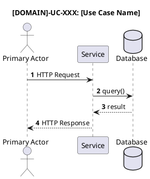
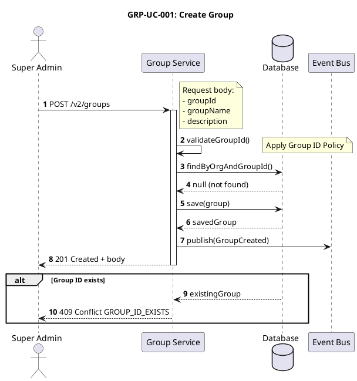

# PlantUML Sequence Diagram Format

Sequence diagrams are specified using PlantUML syntax in fenced code blocks. Diagrams should be **slim** - minimize participants, omit implied infrastructure, and use grouping for related services.

> **Note**: Sequence diagrams MUST be placed **first** in each use case section, immediately after the use case header (e.g., after `## GRP-UC-001: Create Group`), before "Use Case Overview".

#### Basic Structure

````markdown

````

#### Required Directives

| Directive | Usage | Description |
|-----------|-------|-------------|
| `autonumber` | After `@startuml` | Auto-number all messages sequentially |
| `title` | After `autonumber` | Include UC ID and name |

#### Step Synchronization Rule

**Sequence diagram autonumbers MUST align with Main Success Scenario (MSS) step numbers.**

This ensures developers can trace each MSS step to its corresponding diagram message:

1. **One-to-one mapping**: Each MSS step corresponds to a numbered message
2. **Grouped steps allowed**: MSS may group steps (e.g., "4-5 System validates input") - show both steps in diagram
3. **Include validation steps**: If MSS mentions validation, the diagram must show a self-call

**Example - MSS to Diagram Alignment:**

| MSS Step | Diagram Message |
|----------|-----------------|
| 1. Actor submits request | 1. POST /v2/resource |
| 2. System validates group exists | 2. findByKey() |
| 3. System validates actor permission | 3. validateActorPermission() |
| 4-5. System validates member exists | 4. findUser(), 5. (response) |

#### Business Validation - INCLUDE with Logic

**INCLUDE** business-specific validation as self-calls with explanatory notes:

```plantuml
Service -> Service: validateActorPermission()
note right
Actor must have:
- Owner or Manager role in group
- OR Group Admin permission
end note
```

**Validation patterns to INCLUDE:**
| Validation Type | How to Show |
|-----------------|-------------|
| Role-based access | Self-call + note with role conditions (owner/manager/admin) |
| Ownership check | Self-call + note explaining ownership rule |
| Resource permission | Self-call + note with permission name |
| Business constraint | Self-call + note (e.g., circular reference check) |

#### Implied Components - DO NOT Include

| Component | Reason to Omit |
|-----------|----------------|
| **API Gateway** | Infrastructure - implied in all requests |
| **Access Control Service (generic)** | Generic permission checks without business context |
| **Generic `validatePermissions()`** | Replace with business-specific validation showing actual logic |
| **Token validation** | Authentication is implied |

#### Event Consumer Documentation

When publishing events to Event Bus, add a note listing the services that consume the event. This documents the event flow without adding explicit participants:

```plantuml
Service -> Events: publish(GroupCreated)
note right of Events
Consumed by:
- Activity Tracker
- Notification Service
end note
```

#### Breaking Long API Paths

When API paths exceed diagram width (~60 characters), insert `\n` to break the line:

```plantuml
' Bad - too wide
Actor -> Service: DELETE /v2/groups/{groupKey}/members/{memberId}?memberType=USER

' Good - broken before query parameter  
Actor -> Service: DELETE /v2/groups/{groupKey}/members/{memberId}\n?memberType=USER
```

#### Participant Minimization

Group related services using multi-line participant names with `\n`:

```plantuml
' Instead of separate participants:
' participant "Profile Service" as Profile
' participant "Group Service" as Group  

' Use grouped participant:
participant Profile as "B2B Service\n(Profile, Group, ...)"
```

#### PlantUML Elements

| Element | Syntax | Description |
|---------|--------|-------------|
| Actor | `actor "Name" as Alias` | Human user |
| Participant | `participant "Name" as Alias` | System component |
| Grouped participant | `participant Alias as "Name\n(Sub1, Sub2)"` | Multiple services |
| Database | `database "Name" as Alias` | Data store |
| Synchronous message | `A -> B: message` | Request |
| Response | `B --> A: response` | Dashed return arrow |
| Self-call | `A -> A: method()` | Internal processing |
| Alternative | `alt condition ... else ... end` | Branching logic |
| Optional | `opt condition ... end` | Optional flow |
| Loop | `loop condition ... end` | Iteration |
| Group | `group label ... end` | Grouping steps |
| Multi-line note | `note right\n...\nend note` | Complex payloads |
| Colored note | `note right of X #color\n...\nend note` | Visual distinction |

#### Note Colors

| Color | Purpose |
|-------|---------|
| `#lightgreen` | Main flow execution, success paths |
| `#yellow` | State changes, node transitions |
| `#orange` | Error conditions, warnings |

#### Example - Slim PlantUML Diagram


