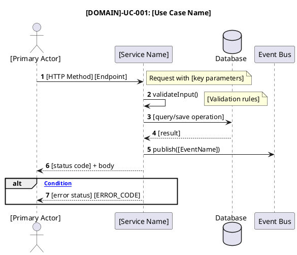
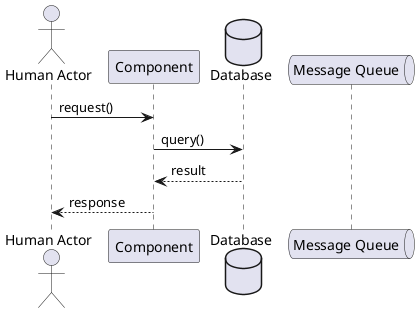
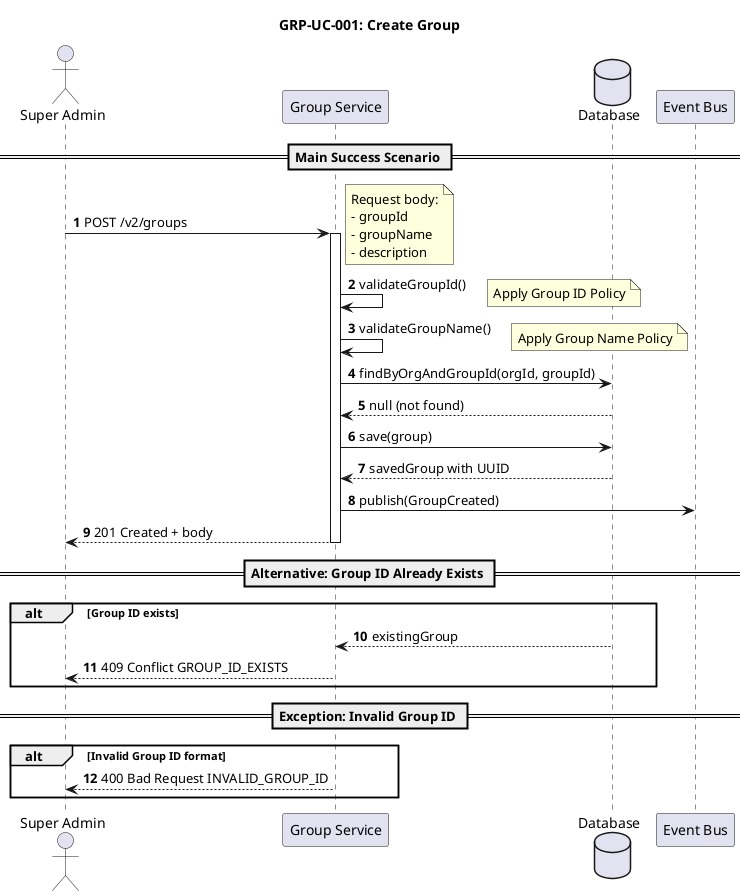
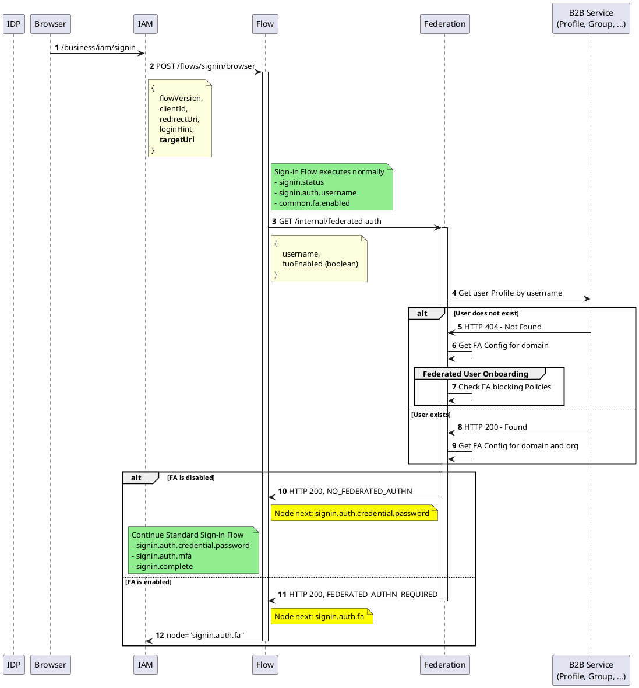
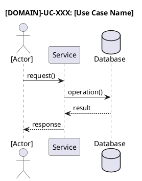
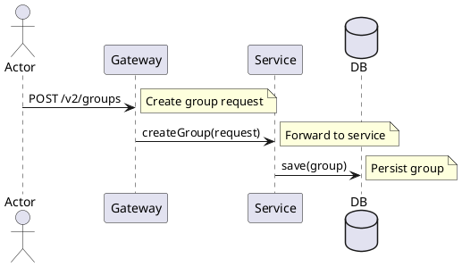

# Use Case Diagrams Document Structure

This document defines the standard structure for Use Case Diagrams documents that accompany SRS documents. While the SRS contains a summary of main use cases, this companion document provides detailed use case specifications with PlantUML sequence diagrams.

## Document Template

```markdown
---
artifact-type: use-case-diagram
lineage-rules: companion of SRS
source-srs: .data/requirements/[Domain]-SRS-[Version].md
---

# [Domain Name] | Use Case Diagrams

## Document Information

| Field | Value |
|-------|-------|
| **Document ID** | [DOMAIN]-Use-Case-Diagrams-[VERSION] |
| **Category** | Use Case Diagrams |
| **Version** | [Major.Minor] |
| **Status** | [Draft/Review/Final] |
| **Created** | [Date] |
| **Related SRS** | [SRS Document ID] |

---

## Use Case Index

| UC ID | Use Case Name | Primary Actor | Related SRS | Section |
|-------|---------------|---------------|-------------|---------|
| [DOMAIN]-UC-001 | [Use Case Name] | [Actor] | [SRS-X.0.0] | [Link to section] |
| [DOMAIN]-UC-002 | [Use Case Name] | [Actor] | [SRS-X.0.1] | [Link to section] |

---

## Actors

### Actor Definitions

| Actor ID | Actor Name | Description | Type |
|----------|------------|-------------|------|
| A-001 | [Actor Name] | [Actor description] | Human/System |
| A-002 | [Actor Name] | [Actor description] | Human/System |

### Actor Hierarchy

```
Organization Users
├── Super Admin (A-001)
│   └── Full CRUD on all resources
├── Admin (A-002)
│   └── CRUD on permitted resources
└── User Roles (per resource)
    ├── Owner (A-003)
    ├── Manager (A-004)
    └── Member (A-005)

System Actors
├── Service (A-010)
├── External System (A-011)
└── Event Bus (A-012)
```

---

## [DOMAIN]-UC-001: [Use Case Name]

### Sequence Diagram

> **Note**: Sequence diagrams MUST be placed first in each use case section, immediately after the use case header.



### Use Case Overview

| Field | Value |
|-------|-------|
| **UC ID** | [DOMAIN]-UC-001 |
| **Name** | [Use Case Name] |
| **Primary Actor** | [Actor Name] |
| **Secondary Actors** | [Actor Name(s)] or None |
| **Trigger** | [What initiates this use case] |
| **Preconditions** | [What must be true before execution] |
| **Postconditions** | [What is true after successful execution] |
| **Related SRS** | [SRS-X.0.0, SRS-X.0.1] |

### Description

[Detailed description of the use case, including:
- Purpose and business value
- Context within the system
- Key interactions]

### Main Success Scenario (Happy Path)

1. [Actor] [initiates action]
2. System [responds/processes]
3. [Actor] [next action]
4. System [responds/processes]
5. [Continue until completion]

### Alternative Scenarios

#### [Alt-A]: [Alternative Scenario Name]

**Condition**: [When this alternative occurs]

1. At step [N] of Main Success Scenario
2. [Actor/System] [alternative action]
3. [Continue with alternative flow]
4. [Rejoin Main Success Scenario at step M / End]

#### [Alt-B]: [Alternative Scenario Name]

**Condition**: [When this alternative occurs]

[Alternative flow steps]

### Exception Scenarios

#### [Exc-A]: [Exception Name]

**Condition**: [Error condition]

1. At step [N] of Main Success Scenario
2. System detects [error condition]
3. System [error handling action]
4. [Actor] [receives error response]
5. [Resolution or end state]

### Data Flow

| Step | Input | Output | Validation |
|------|-------|--------|------------|
| 1 | [Input data] | - | [Validation rules] |
| 2 | [Input data] | [Output data] | [Validation rules] |

### Related APIs

| API ID | Operation | Method | Path |
|--------|-----------|--------|------|
| [DOMAIN]-API-001 | [Operation] | [HTTP] | [Path] |

**Source SRS**: [DOMAIN]-[TYPE]-[VERSION].[SECTION].[SUBSECTION]

---

## [DOMAIN]-UC-002: [Use Case Name]

[Same structure as [DOMAIN]-UC-001]

---

## Appendix A: PlantUML Sequence Diagram Guide

### PlantUML Syntax Reference

Sequence diagrams are specified using PlantUML syntax in fenced code blocks:



### Participant Types

| Type | Syntax | Description |
|------|--------|-------------|
| Actor | `actor "Name" as Alias` | Human user |
| Participant | `participant "Name" as Alias` | System component |
| Database | `database "Name" as Alias` | Data store |
| Queue | `queue "Name" as Alias` | Message queue |
| Entity | `entity "Name" as Alias` | Domain entity |
| Control | `control "Name" as Alias` | Controller/service |
| Boundary | `boundary "Name" as Alias` | API boundary |

### Message Types

| Type | Syntax | Description |
|------|--------|-------------|
| Synchronous | `A -> B: message` | Request with solid arrow |
| Response | `B --> A: response` | Return with dashed arrow |
| Asynchronous | `A ->> B: message` | Async message |
| Self-call | `A -> A: method()` | Internal processing |

### Control Flow Fragments

| Fragment | Syntax | Description |
|----------|--------|-------------|
| Alternative | `alt condition ... else ... end` | If-else branching |
| Optional | `opt condition ... end` | Optional flow |
| Loop | `loop condition ... end` | Iteration |
| Break | `break condition ... end` | Exit loop |
| Group | `group label ... end` | Grouping steps |
| Note | `note right: text` | Annotation |

### Complete Example



### Best Practices

1. **Use `autonumber`**: Always add `autonumber` after `@startuml` to auto-number all messages
2. **Use Activation Bars**: Show when a component is active with `activate`/`deactivate`
3. **Add Notes**: Explain complex logic with `note right:` or `note left:` - use multi-line notes for complex payloads
4. **Group Scenarios**: Use `== Section Name ==` to separate scenarios
5. **Include Error Handling**: Always show at least one exception flow using `alt`
6. **Use Meaningful Names**: Use business-relevant names for messages (e.g., `createGroup()` not `process()`)

### Step Synchronization Rule

**Sequence diagram autonumbers MUST align with Main Success Scenario (MSS) step numbers.**

This ensures developers can trace each MSS step to its corresponding diagram message. When generating diagrams:

1. **One-to-one mapping**: Each MSS step should correspond to a numbered message in the diagram
2. **Grouped steps allowed**: MSS may group related steps (e.g., "4-5 System validates input") - the diagram should show steps 4 and 5 separately
3. **Include internal validation**: If MSS mentions a validation step, the diagram must include a self-call showing that validation

**Example - MSS to Diagram Alignment:**

| MSS Step | Diagram Message |
|----------|-----------------|
| 1. Actor submits request | 1. POST /v2/resource |
| 2. System validates group exists | 2. findByKey() |
| 3. System validates actor permission | 3. validateActorPermission() |
| 4-5. System validates member exists | 4. findUser(), 5. (response) |
| 6. System creates record | 6. save() |

### Business Validation in Sequence Diagrams

**INCLUDE** business-specific validation logic as self-calls with explanatory notes:

```plantuml
Service -> Service: validateActorPermission()
note right
Actor must have:
- Owner or Manager role in group
- OR Group Admin permission
end note
```

**Business validation patterns to INCLUDE:**
| Validation Type | Example | How to Show |
|-----------------|---------|-------------|
| Role-based access | "Check if actor has owner/manager group role" | Self-call + note with role conditions |
| Ownership check | "Validate actor owns the resource" | Self-call + note explaining ownership rule |
| Resource permission | "Check group.write permission" | Self-call + note with permission name |
| Business constraint | "Validate no circular reference" | Self-call + note with constraint description |

**Infrastructure logic to EXCLUDE** (these are implied):
| Component | Why Omit |
|-----------|----------|
| API Gateway | Infrastructure routing - implied in all requests |
| Access Control Service (generic call) | Generic permission check without business context |
| Generic `validatePermissions()` | Too abstract - replace with business-specific validation |
| Token validation | Authentication is implied |

**Pattern for replacing generic permission checks:**

```plantuml
' BAD - too generic, omit this:
' Service -> AccessControl: validatePermissions()

' GOOD - business-specific validation with logic:
Service -> Service: validateActorPermission()
note right
Check: actor has owner/manager role
OR possesses group.write permission
end note
```

### Slim PlantUML Guidelines

Keep diagrams focused and readable by minimizing participants and removing implicit infrastructure:

#### Implied Components - DO NOT Include

| Component | Reason to Omit |
|-----------|----------------|
| **API Gateway** | Infrastructure component implied in all requests - not business logic |
| **Access Control / Auth Service** | Generic permission checks are implied unless authorization is the API's core purpose |
| **Generic `validatePermissions()` step** | Omit unless it contains business logic specific to the API operation |

#### Event Consumer Documentation

When publishing events to Event Bus, add a note listing the services that consume the event. This documents the event flow without adding explicit participants:

```plantuml
Service -> Events: publish(GroupCreated)
note right of Events
Consumed by:
- Activity Tracker
- Notification Service
end note
```

#### Breaking Long API Paths

When API paths or descriptions exceed diagram width (approximately 60 characters), insert `\n` characters to break the line.

**Preferred break points:**
- Before query parameters (`?`)
- Between logical path segments

**Example:**
```plantuml
' Bad - too wide, makes diagram overflow
Actor -> Service: DELETE /v2/groups/{groupKey}/members/{memberId}?memberType=USER

' Good - broken before query parameter  
Actor -> Service: DELETE /v2/groups/{groupKey}/members/{memberId}\n?memberType=USER
```

#### Participant Minimization

**Goal**: Use as few participants as possible while maintaining clarity.

**Grouping Related Services**: When multiple backend services perform similar roles, combine them into a single participant:

```plantuml
' Instead of separate participants:
' participant "Profile Service" as Profile
' participant "Group Service" as Group  
' participant "Membership Service" as Membership

' Use grouped participant:
participant Profile as "B2B Service\n(Profile, Group, ...)"
```

**Multi-line Participant Names**: Use `\n` for line breaks in participant labels to show grouped services or add context:

```plantuml
participant Flow as "Flow Service\n(SignIn, SignUp)"
participant Federation as "Federation\n(FA, SSO)"
participant Profile as "B2B Service\n(Profile, Group, ...)"
```

#### Breaking Long Payloads

For complex request/response payloads, use multi-line notes instead of inline descriptions:

```plantuml
' Bad - long inline note
Service -> DB: save(group) ' This is a very long description that explains everything

' Good - multi-line note block
Service -> DB: save(group)
note right
{
    groupId,
    groupName,
    description,
    orgId,
    createdBy
}
end note
```

#### Colored Notes for Different Purposes

Use note colors to distinguish note types:

```plantuml
note right of Service #lightgreen
Main flow execution
- Step 1
- Step 2
end note

note right of Service #yellow
Node state change:
next = signin.auth.mfa
end note

note right of Service #orange
Error condition detected
end note
```

### Advanced Example - Federated Authentication Flow

This example demonstrates slim PlantUML best practices with grouped participants, autonumber, and complex flows:



---

## Appendix B: Naming Conventions

### Use Case IDs

Use Case IDs follow a domain-prefixed pattern:

```
[DOMAIN]-UC-[NUMBER]

Examples:
- GRP-UC-001  (Group service, Use Case #1)
- GRP-UC-002  (Group service, Use Case #2)
- ROLE-UC-001 (Role service, Use Case #1)
```

### Flow Identifiers

| Type | Format | Example |
|------|--------|---------|
| Use Case ID | [DOMAIN]-UC-XXX | GRP-UC-001 |
| Alternative Flow | Alt-[Letter] | Alt-A, Alt-B |
| Exception Flow | Exc-[Letter] | Exc-A, Exc-B |

### Diagram Titles

Use the format: `[UC-ID]: [Use Case Name]`

Example: `GRP-UC-001: Create Group`

---

## Appendix C: Use Case Template Reference

### Quick Template

```markdown
## [DOMAIN]-UC-XXX: [Use Case Name]

### Overview
| Field | Value |
|-------|-------|
| **UC ID** | [DOMAIN]-UC-XXX |
| **Name** | [Name] |
| **Primary Actor** | [Actor] |
| **Preconditions** | [Conditions] |
| **Postconditions** | [Results] |

### Main Success Scenario
1. [Step 1]
2. [Step 2]
3. [Step 3]

### Sequence Diagram



**Source SRS**: [DOMAIN]-[TYPE]-[VERSION].[SECTION].[SUBSECTION]
```

---

## Appendix D: Migration from Table Format

If converting from the legacy table-based message sequence format, follow these mappings:

### Legacy Table Format (DEPRECATED)

```markdown
**Message Sequence:**

| # | From | To | Message | Description |
|---|------|-----|---------|-------------|
| 1 | Actor | Gateway | POST /v2/groups | Create group request |
| 2 | Gateway | Service | createGroup(request) | Forward to service |
| 3 | Service | DB | save(group) | Persist group |
```

### PlantUML Format (CURRENT)



### Conversion Rules

| Table Element | PlantUML Equivalent |
|---------------|---------------------|
| `From` column | Left side of arrow |
| `To` column | Right side of arrow |
| `Message` column | Arrow label |
| `Description` column | `note right:` annotation |
| Row number | Implicit (top-to-bottom order) |

---

## Document History

| Version | Date | Author | Changes |
|---------|------|--------|---------|
| [X.Y] | [Date] | [Author] | [Change description] |
```

> **Note on Appendixes**: Generated Use Case Diagrams documents should NOT include the following appendixes (they add unnecessary verbosity without significant value):
> - Diagram Conventions (implied by using PlantUML standards)
> - API ID Cross-Reference (redundant - already in "Related APIs" per use case)
> - Use Case to FS Traceability (redundant - already in SRS document traceability)

---

## Guidelines for Creating Use Case Diagrams

### Identifying Use Cases

Use cases should be identified from:

1. **SRS Feature Sets**: Each major feature set typically has 1-3 primary use cases
2. **CRUD Operations**: Create, Read, Update, Delete flows for main entities
3. **User Workflows**: End-to-end user journeys through the system
4. **Integration Points**: Interactions with external systems

### Use Case Granularity

| Level | Description | Example |
|-------|-------------|---------|
| **Too High** | Entire feature area | "Manage Roles" |
| **Correct** | Single user goal | "Create System Role" |
| **Too Low** | Single step | "Validate Role Name" |

### Required Elements

Every use case MUST include:

- [ ] Unique UC ID with domain prefix (e.g., GRP-UC-001)
- [ ] Clear descriptive name
- [ ] Primary actor identification
- [ ] Preconditions and postconditions
- [ ] Main success scenario (numbered steps)
- [ ] At least one alternative scenario
- [ ] At least one exception scenario
- [ ] PlantUML sequence diagram in ```plantuml code block
- [ ] Related SRS requirement references
- [ ] Related API references with domain prefix (e.g., GRP-API-101)

### Sequence Diagram Requirements

Every PlantUML sequence diagram MUST include:

- [ ] Title with UC ID and name
- [ ] All participating actors and system components
- [ ] Request/response message pairs with proper arrow notation
- [ ] Notes explaining key validation or business logic
- [ ] At least one alternative flow using `alt ... end` fragment
- [ ] Error handling for at least one exception

### Relationship to SRS

| SRS Section | Use Case Diagrams Section |
|-------------|---------------------------|
| Main Use Cases (summary) | Full use case specifications |
| Feature Set Sections | Individual use case details |
| API Reference | Related APIs per use case |
| Test Cases | Scenario validation |

The Use Case Diagrams document expands on the summary in the SRS Main Use Cases section, providing detailed PlantUML sequence diagrams and flow specifications for development and testing teams.